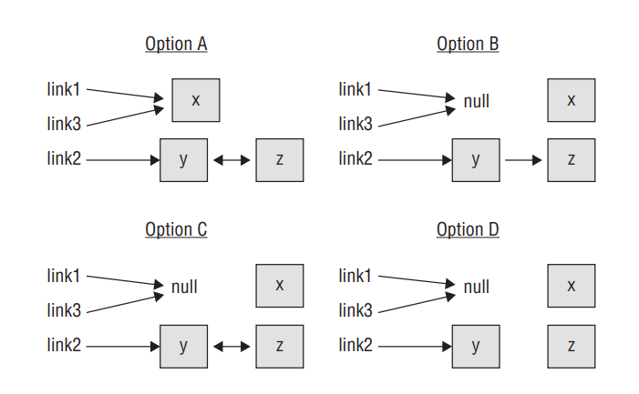

# Ejercicios de Java - Capítulo 2

---

## 1. Which of the following declarations does not compile?

**Respuesta: A. `double num1, int num2 = 0;`**

No puedes declarar variables de distintos tipos en una misma declaración.

---

## 2. What is the output of the following?

**Respuesta: D. The code does not compile.**

`chair` es una variable local que nunca fue inicializada. Las variables locales en Java no tienen valor por defecto, por lo que usarla antes de asignarle un valor genera un error de compilación.

---

## 3. Which is correct about an instance variable of type String?

**Respuesta: B. It defaults to null.**

Las variables de instancia sí tienen valor por defecto. Para cualquier tipo de referencia (incluyendo `String`), ese valor por defecto es `null`.

---

## 4. Which of the following is not a valid variable name?

**Respuesta: B. `2blue`**

Los identificadores en Java no pueden comenzar con un dígito.

---

## 5. Which of these class names best follows standard Java naming conventions?

**Respuesta: B. `FooBar`**

La convención estándar para nombres de clases en Java es **PascalCase**: cada palabra comienza con mayúscula.

---

## 6. How many of the following methods compile?

**Respuesta: C. Two**

El primer método **no compila**: `int` es un tipo primitivo y no tiene métodos como `.toString()`. Los otros dos sí compilan, ya que `Integer` y `Object` son tipos de referencia con ese método
disponible.

---

## 7. Which of the following does not compile?

**Respuesta: C. `int num = _9_99;`**

Los guiones bajos en literales numéricos son válidos en Java, pero **no pueden estar al inicio ni al final** del número. `_9_99` comienza con `_`, lo que causa un error de compilación.

---

## 8. Which of the following is a wrapper class?

**Respuesta: C. `Integer`**

`Integer` es la clase envolvente del tipo primitivo `int`.

---

## 9. What is the result of running this code?

**Respuesta: C. The code does not compile.**

`integer` no existe en Java. El tipo correcto es `Integer`.

---

## 10. Which best describes what the `new` keyword does?

**Respuesta: C. Instantiates a new object.**

La palabra clave `new` reserva memoria en el heap y crea una nueva instancia de la clase indicada, invocando su constructor.

---

## 11. Which is the first line to trigger a compiler error?

**Respuesta: D. p4**

`5.0` sin sufijo es por defecto un `double`, y asignarlo a un `float` requeriría un cast explícito, ya que sería un
narrowing implícito. Por eso `p4` es la primera línea que falla.

---

## 12. Which of the following lists of primitive types are presented in order from smallest to largest data type?

**Respuesta: A. `byte, char, float, double`**

En términos de tamaño en bits: `byte` (8), `char` (16), `float` (32), `double` (64). Es el único orden estrictamente creciente de las opciones. `bigint` en la opción D no existe como tipo primitivo en
Java.

---

## 13. Which of the following is not a valid order for elements in a class?

**Respuesta: D. None of the above: all orders are valid.**

Java no impone un orden específico para los elementos dentro de una clase. Variables de instancia, constructores y métodos pueden aparecer en cualquier orden y el código compilará sin problema.

---

## 14. Which of the following lines contains a compiler error?

**Respuesta: B. x2**

No se pueden declarar variables de distintos tipos (`int` y `double`) en una misma sentencia separada por coma. Cada tipo debe declararse por separado.

---

## 15. How many instance initializers are in this code?

**Respuesta: C. Two**

Los instance initializers son bloques `{ }` definidos directamente en el cuerpo de la clase, fuera de métodos o constructores. Hay dos: líneas 2 y 7. El bloque de la línea 6 es un **static initializer
**, y el constructor no cuenta como initializer.

---

## 16. Of the types `double`, `int`, and `short`, how many could fill in the blank to output `0`?

**Respuesta: A. None**

`defaultValue` es una variable **local**. Las variables locales no tienen valor por defecto en Java, sin importar su tipo. Usarlas sin inicializar causa un error de compilación, por lo que ninguno de
los tres tipos produciría la salida `0`.

---

## 17. What is true of the `finalize()` method?

**Respuesta: A. It may be called zero or one times.**

El método `finalize()` puede ser invocado por el garbage collector antes de liberar el objeto, pero no hay garantía de que ocurra. Puede no ejecutarse nunca si el programa termina antes o el GC decide
no invocarlo. Lo que sí es seguro es que no se llamará más de una vez por objeto.

---

## 18. Which of the following is not a wrapper class?

**Respuesta: D. `String`**

`Double`, `Integer` y `Long` son clases envolventes de los primitivos `double`, `int` y `long` respectivamente. `String` no es un wrapper; es una clase independiente que representa cadenas
de texto.

---

## 19. Which image best represents the state of references right before the end of main?

**Respuesta: D. Option D**

Trazando el estado final línea por línea:

- Tras las líneas 15-17: `link1 → x`, `link2 → y → x`, `link3 → z → y`.
- Líneas 18-19: `y` y `z` se apuntan mutuamente (`y ↔ z`). El objeto `x` pierde su única referencia interna (`y.next` ahora apunta a `z`).
- Línea 20: `link1 = null` → la variable ya no apunta a `x`; el objeto `x` queda completamente aislado (candidato a GC).
- Línea 21: `link3 = null` → la variable ya no apunta a `z`, pero `z` sigue siendo alcanzable a través de `y.next`.

Estado final: `link1 → null`, `link3 → null`, `link2 → y`, con `y ↔ z` apuntándose mutuamente, y `x` aislado sin referencias.

---

## 20. Which type can fill in the blank? `_____ pi = 3.14;`

**Respuesta: C. `double`**

`3.14` es un literal de punto flotante que en Java es de tipo `double` por defecto. `float` no funciona porque requeriría el sufijo `f`.

---

## 21. What is the first line in the following code to not compile?

**Respuesta: B. k2**

`k1` es válido: aunque no es buena práctica, `Integer` puede usarse como nombre de variable. `k2` falla porque `int` sí es una **palabra reservada** en Java y no puede usarse
como nombre de variable.

---

## 22. Which of the following is not true about `foo.bar`?

**Respuesta: B. bar is a local variable.**

La notación `foo.bar` indica que se accede a un miembro a través de una referencia (`foo`). Las variables locales existen únicamente dentro de un método y no se acceden con notación de punto; por lo
tanto, `bar` debe ser una variable de instancia, no local.

---

## 23. Which of the following is not a valid class declaration?

**Respuesta: C. `class 5MainSt {}`**

Los identificadores en Java no pueden comenzar con un dígito.

---

## 24. Which of the following can fill in the blanks? `_____ d = new _____(1_000_000_.00);`

**Respuesta: D. None of the above**

El literal `1_000_000_.00` no es válido: el guion bajo no puede aparecer justo antes del punto decimal. Si fuera `1_000_000.00`, la respuesta sería `Double, Double`, pero ninguna de las opciones
contempla eso correctamente. Por eso ninguna opción aplica.

---

## 25. Which is correct about a local variable of type String?

**Respuesta: C. It does not have a default value.**

Las variables **locales** en Java no tienen valor por defecto, independientemente del tipo. Deben inicializarse explícitamente antes de usarse o el compilador lanza un error. Esto contrasta con las
variables de instancia, que sí tienen default (`null` para referencias).

---

## 26. Of the types `double`, `int`, `long`, and `short`, how many could fill in the blank to output `0`?

**Respuesta: D. Four**

Aquí `defaultValue` es una variable **estática** (de clase), no local. Las variables de clase sí tienen valor por defecto: `0` para todos los tipos numéricos primitivos. Los cuatro tipos (`double` →
`0.0`, `int` → `0`, `long` → `0`, `short` → `0`) producirían una salida de `0`.

---

## 27. Which of the following is true about primitives?

**Respuesta: B. You can convert a primitive to a wrapper class object simply by assigning it.**

Esto se llama **autoboxing**: Java convierte automáticamente un primitivo en su wrapper al asignarlo (ej. `Integer i = 5;`). Las demás opciones son falsas: los primitivos no tienen métodos,
`valueOf()` convierte wrapper a primitivo de forma inversa (unboxing), y los `ArrayList` no aceptan primitivos directamente.

---

## 28. What is the output of the following?

**Respuesta: C. The code does not compile.**

`i` es de tipo primitivo `int`. Una vez que `new Integer(4)` se desempaqueta (unboxing) hacia `int`, `i` ya no es un objeto y no tiene métodos como `.byteValue()`. Llamar un método sobre un primitivo
causa un error de compilación.

---

## 29. Fill in the blank to have the code print `bounce`.

**Respuesta: D. `new TennisBall();`**

Para ejecutar el constructor (que imprime `"bounce"`), se debe instanciar la clase con `new TennisBall()`. Las opciones A y C no son sintaxis válidas en Java. La opción B, `TennisBall()`, tampoco
compila fuera de un contexto de llamada al constructor padre (`super()`).

---

## 30. Which of the following correctly assigns `"animal"` to both variables?

**Respuesta: A. I**

- **I** (`String cat = "animal", dog = "animal";`) válido: declara y asigna ambas.
- **II** falla: `dog` no está declarada con tipo antes de usarse.
- **III** (`String cat, dog = "animal";`) solo asigna `"animal"` a `dog`; `cat` queda sin valor.
- **IV** no es sintaxis válida en Java.

---

## 31. Which two primitives have wrapper classes not merely named with an uppercase first letter?

**Respuesta: C. `char` and `int`**

- `char` → `Character` (no solo "Char")
- `int` → `Integer` (no solo "Int")
- `byte` → `Byte` (solo mayúscula), `short` → `Short`, `long` → `Long`, etc.

---

## 32. Which of the following is true about String instance variables?

**Respuesta: A. They can be set to null.**

Las variables de instancia de tipo `String` son tipos de referencia, y cualquier referencia en Java puede apuntar a `null`. Las demás opciones son falsas: pueden ser accedidas desde fuera (si son
públicas), asignadas en cualquier método, y modificadas múltiples veces.

---

## 33. Which statement is true about primitives?

**Respuesta: A. Primitive types begin with a lowercase letter.**

En Java, todos los tipos primitivos (`int`, `double`, `char`, `boolean`, etc.) se escriben en minúscula. No pueden ser `null`, `String` no es un primitivo (es una clase), y no es posible crear tipos
primitivos propios.

---

## 34. How do you force garbage collection to occur at a certain point?

**Respuesta: D. None of the above**

`System.gc()` existe en Java (opción B), pero solo es una **sugerencia** a la JVM; no garantiza que el garbage collector se ejecute en ese momento. No es posible forzar el GC de manera determinista en
Java.

---

## 35. How many String objects are eligible for GC right before the end of main?

**Respuesta: C. Two**

Al finalizar, `fruit1`, `fruit2` y `fruit3` apuntan todas al objeto `"apple"`. Los objetos `"pear"` y `"orange"` quedaron sin referencias tras las reasignaciones, por lo que son elegibles para GC.
`"apple"` sigue vivo.

---

## 36. Which of the following can fill in the blanks? `_____ d = new _____(1_000_000.00);`

**Respuesta: B. `double, Double`**

A diferencia de la pregunta 24, aquí el literal `1_000_000.00` es **válido** (el guion bajo no está junto al punto decimal). El tipo de la variable puede ser `double` (primitivo), y
`new Double(1_000_000.00)` crea un objeto wrapper que se desempaqueta automáticamente. La opción A no compila porque `new double(...)` no es válido (los primitivos no se instancian con `new`).

---

## 37. What does the following output?

**Respuesta: B. constructor**

El orden de inicialización en Java es: (1) variables de instancia, (2) bloques de inicialización de instancia, (3) constructor. Aunque el bloque aparece después del constructor en el código fuente, el
compilador lo reordena. El valor final de `first` al terminar el constructor es `"constructor"`.

---

## 38. How many of the following lines compile?

**Respuesta: C. Two**

Solo `Integer` y `String` son tipos de referencia y pueden asignarse a `null`. El primitivo `int` no puede ser `null` y genera un error de compilación.

---

## 39. Which pairs of statements accurately fill in the blanks?

**Respuesta: C. Blank 1: an instance method only, Blank 2: an instance or static method**

Las variables de instancia solo son accesibles desde métodos de instancia (no desde `static`, porque no existe `this`). Las variables estáticas pertenecen a la clase y son accesibles tanto desde
métodos de instancia como estáticos.

---

## 40. Which of the following does not compile?

**Respuesta: B. `double num = 2._718;`**

El guion bajo en literales numéricos no puede estar inmediatamente después del punto decimal. `2._718` es inválido. `2.718` y `2.7_1_8` sí compilan correctamente.

---

## 41. Which list of primitive numeric types is in order from smallest to largest?

**Respuesta: A. `byte, short, int, long`**

En bits: `byte` (8), `short` (16), `int` (32), `long` (64). Es el único orden estrictamente creciente entre las opciones.

---

## 42. Fill in the blank to make the code compile.

**Respuesta: A. `cat.name`**

La notación de punto es la forma estándar de acceder a variables de instancia en Java. `cat-name` no es sintaxis válida, `cat.setName` sería un método (no declarado aquí), y `cat[name]` es notación de
arreglo, tampoco válida aquí.

---

## 43. What is the output of this code, assuming it runs to completion?

**Respuesta: B. `play-play`**

El método se llama `finalizer()`, no `finalize()`. Java llama automáticamente a `finalize()` (con esa firma exacta) antes del GC; como aquí el nombre es diferente, nunca se invoca automáticamente.
Solo se imprimen los dos `play-`.

---

## 44. Which is the most common way to fill in the blank?

**Respuesta: A. `p.beakLength = b;`**

Aunque `beakLength` es `private`, este método está dentro de la misma clase (`Penguin`), por lo que tiene acceso directo al campo privado a través de la referencia `p`. La notación de punto es la
forma estándar y más común.

---

## 45. Fill in the blanks (primitive or wrapper, without autoboxing).

**Respuesta: B. `int, Integer`**

`Integer.parseInt()` retorna el primitivo `int`. `Integer.valueOf()` retorna un objeto `Integer`. Asignarlos directamente a esos tipos no requiere autoboxing.

---

## 46. How many objects are eligible for GC right before the end of main?

**Respuesta: B. One**

Al finalizar: `elena` → `obj_elena`, `obj_elena.youngestChild` → `obj_zoe`. El objeto `obj_diana` quedó sin referencias tras la línea 10, siendo el único elegible para GC. `obj_zoe` sigue vivo a
través de `elena.youngestChild`.

---

## 47. Which is a valid constructor for this class?

**Respuesta: C. `public TennisBall() {}`**

Un constructor válido en Java tiene el mismo nombre que la clase y **no tiene tipo de retorno** (ni siquiera `void`). Las opciones A y B incluyen la palabra clave `static`, que no es válida en
constructores. La opción D incluye `void`, convirtiéndolo en un método normal, no un constructor.

---

## 48. Which is not a possible output of this code?

**Respuesta: A. `play`**

`car.play()` siempre se ejecuta primero, así que la salida siempre comienza con al menos `"play-"`. Una salida de solo `"play"` (sin guion) nunca puede ocurrir. Las demás opciones son posibles
dependiendo de cuándo y si el GC invoca `finalize()`.

---

## 49. Which converts a primitive to a wrapper class object without using autoboxing?

**Respuesta: B. Call the constructor of the wrapper class**

Por ejemplo, `new Integer(5)` crea explícitamente un objeto `Integer` sin autoboxing. `asObject()`, `convertToObject()` y `toObject()` no existen en Java.

---

## 50. What is the output of the following?

**Respuesta: C. aab**

1. `new Sand()` en `main` invoca el constructor → imprime `"a"`.
2. `.run()` se ejecuta: `new Sand()` → constructor → `"a"`, luego `Sand()` → método → `"b"`.
3. Salida total: `"aab"`.

En Java es válido tener un método con el mismo nombre que la clase siempre que tenga tipo de retorno; el compilador lo distingue del constructor.

---
