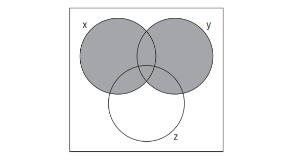

# Ejercicios de Java — Capítulo 3

---

## 1. Which of the following variable types is not permitted in a switch statement?

**Respuesta: B. `double`**

Un `switch` en Java acepta: `byte`, `short`, `char`, `int`, sus wrappers (`Byte`, `Short`, `Character`, `Integer`), `String` y `enum`. Los tipos de punto flotante (`float`, `double`) **no están
permitidos** porque no se pueden comparar con exactitud.

---

## 2. What is the value of `tip` after executing the following code snippet?

**Respuesta: A. 1**

`meal > 6` → `5 > 6` → `false`, por lo que se evalúa `--tip` (pre-decremento): `tip` pasa de `2` a `1` antes de usarse. El valor final de `tip` es `1`.

---

## 3. What is the output of the following application?

**Respuesta: C. `false true`**

`==` compara referencias: `john` apunta al String pool, `jon` es un nuevo objeto en el heap → `false`. `.equals()` compara contenido: ambos contienen `"john"` → `true`.

---

## 4. What is the output of the following application?

**Respuesta: D. None of the above**

El código **no compila**. Hay un segundo `else` que no está asociado a ningún `if` válido: el bloque `else { if(...) }` ya cierra el `if-else`, y el siguiente `else` queda huérfano, causando un error
de compilación.

---

## 5. Which statement about a `default` branch in a switch is correct?

**Respuesta: C. Unlike a case statement, the default statement does not take a value.**

`default` no requiere un valor de comparación; actúa como el caso genérico cuando ningún `case` coincide. No es obligatorio en un `switch`, puede colocarse en cualquier posición, y no requiere que
haya al menos un `case`.

---

## 6. What is the value of `thatNumber` after execution?

**Respuesta: B. 4**

El ternario devuelve `3`. Luego `++thatNumber` lo incrementa a `4`. La condición `4 < 4` es `false`, así que no se ejecuta el `+= 1`. Resultado: `4`.

---

## 7. Which statement immediately exits a switch statement?

**Respuesta: B. `break`**

`break` es la sentencia que termina la ejecución del `switch` y transfiere el control al código posterior. Sin `break`, la ejecución "cae" al siguiente `case` (fall-through). `exit`, `goto` y
`continue` no cumplen esta función en un `switch`.

---

## 8. Which statement about ternary expressions is true?

**Respuesta: C. The ternary expression is a convenient replacement for an if-then-else statement.**

Solo se evalúa **una** de las dos expresiones de la derecha (nunca ambas). Los paréntesis no son obligatorios. El operando izquierdo debe ser una expresión `boolean`, no `int`.

---

## 9. What is the output of the following application?

**Respuesta: C. The code does not compile.**

La línea 4 intenta usar el operador `&&` con variables de tipo `Integer`, pero `&&` solo opera sobre `boolean`. Esto causa un error de compilación antes de llegar al posible `NullPointerException`.

---

## 10. What is the output of the following application?

**Respuesta: A. 2**

`6 % 3 = 0`, y `0 >= 1` es `false`, por lo que `triceratops` no se incrementa. Luego `triceratops--` lo lleva de `3` a `2`.

---

## 11. Which statement about if-then statements is true?

**Respuesta: D. An if-then statement can execute a single statement or a block `{}`.**

Un `if` puede ir seguido de una sola sentencia (sin llaves) o de un bloque. No es obligatorio tener `else`, no se ejecuta si la condición es `false`, y no requiere cast.

---

## 12. What is the output of the following application?

**Respuesta: D. None of the above**

El primer `if` imprime `"Not enough"`. El segundo `if` es independiente: `flair == 37` es `false`, así que imprime el `else`: `"Too many"`. La salida completa es `"Not enoughToo many"`, que no
coincide con ninguna opción individual.

---

## 13. Which statement about case statements is not true?

**Respuesta: B. A case statement must be terminated with a break statement.**

`break` **no es obligatorio** en un `case`; sin él ocurre fall-through (se ejecutan los casos siguientes). Las demás afirmaciones son verdaderas: un valor de `case` puede ser `final`, puede ser un
literal, y debe coincidir con el tipo del `switch`.

---

## 14. Which operator corresponds to the truth table?

**Respuesta: D. `&&`**

La tabla muestra que el resultado es `true` solo cuando **ambos** son `true`. Eso es exactamente el operador AND (`&&`). `||` sería `true` cuando al menos uno es `true`.

---

## 15. What is the output of the following code snippet?

**Respuesta: C. The code does not compile.**

En Java, la condición de un `if` debe ser de tipo `boolean`. `jumps` es un `int`, y no se convierte automáticamente a `boolean` como en C/C++. Esto genera un error de compilación.

---

## 16. Fill in the blanks: increases by 1 and returns the new value; decreases by 1 and returns the original value.

**Respuesta: B. pre-increment `[++v]`, post-decrement `[v--]`**

- `++v` (pre-increment): incrementa y retorna el **nuevo** valor.
- `v--` (post-decrement): retorna el **valor original** y luego decrementa.

---

## 17. What is the output of the following application?

**Respuesta: B. 13**

Siguiendo la precedencia de operadores: primero `(tiger + lion) = 5`, luego `2 * 5 = 10`, luego `lion + 10 = 13`.

---

## 18. What variable type of `saturday` is not permitted in the `case`?

**Respuesta: B. `long`**

El `switch` opera sobre `int` (`dayOfWeek`). Un valor de `case` debe poder promoverse al tipo del `switch`. `byte`, `short` e `int` pueden promoverse a `int`, pero `long` **no** puede, ya que es más
grande y no se hace narrowing implícito.

---

## 19. What is the value of `dinner` after execution?

**Respuesta: C. The code does not compile but would compile if parentheses were added.**

El problema es que el segundo operando del ternario externo es `day`, que es de tipo `int`. Java no convierte `int` a `boolean` implícitamente. Con paréntesis y una expresión booleana válida (
`day > 0 ? ...`) sí compilaría.

---

## 20. What is the output of the following application?

**Respuesta: C. The code does not compile.**

Hay un paréntesis sin cerrar en la expresión: se abre `(2 + (1 + 2 / 5)` con dos aperturas pero solo una clausura. El compilador detecta este error sintáctico.

---

## 21. What is the output of the following application?

**Respuesta: C. `11789`**

La evaluación es de izquierda a derecha: `5 + 6 = 11` (int), luego `11 + "7" = "117"` (String), luego `"117" + 8 = "1178"`, luego `"1178" + 9 = "11789"`.

---

## 22. Fill in the blanks: difference between two numbers / remainder when divided.

**Respuesta: B. `–, %`**

El operador `-` calcula la diferencia entre dos números. El operador `%` (módulo) calcula el residuo de una división entera.

---

## 23. What is the output of the following application?

**Respuesta: B. 11**

La división entera `11/3 = 3`, el residuo `11%3 = 2`. Luego `2 + (3 * 3) = 2 + 9 = 11`. El resultado reconstruye el valor original, como era de esperarse por la propiedad `dog = partA * cat + partB`.

---

## 24. What is the output of the following application?

**Respuesta: B. 2**

`flavors == 30` entra en `case 30`. Sin `break`, cae al `case 40` y al `default`. Resultado: `0 + 1 + 2 - 1 = 2`.

---

## 25. What is the output of the following application?

**Respuesta: C. The code does not compile.**

El tipo de retorno es `String`, pero las dos ramas del ternario retornan tipos incompatibles: `"train"` (String) y `10` (int). Java no puede determinar un tipo común compatible con `String` para el
literal `10`, lo que genera un error de compilación.

---

## 26. Fill in the blanks: if `apples ___ oranges` evaluates to true, then `apples ___ oranges` must also evaluate to true.

**Respuesta: A. `==`, `equals()`**

Si dos referencias son iguales con `==` (apuntan al mismo objeto en memoria), entonces `.equals()` también devolverá `true`, ya que el contenido de un objeto es idéntico a sí mismo. Lo inverso no es
cierto: `.equals()` puede ser `true` aunque `==` sea `false`.

---

## 27. What is the result of `myTestVariable.equals(null)` for a non-null String?

**Respuesta: B. `false`**

El contrato de `.equals()` en Java especifica que comparar cualquier objeto con `null` debe retornar `false`, nunca lanzar una excepción. El código compila y se ejecuta sin problemas.

---

## 28. How many 1s are outputted?

**Respuesta: D. The code does not compile.**

Falta el punto y coma al final de `int intersections = 10`. Además, en el `else if`, se usa `streets && intersections > 1000` donde `streets` es un `int`, no un `boolean`, lo que también causaría
error. El código no compila por ambas razones.

---

## 29. Which statement about `&` and `&&` is true?

**Respuesta: B. The `&` operator always evaluates both operands, while the `&&` operator may only evaluate the left operand.**

`&` es el operador AND no cortocircuitado: siempre evalúa ambos lados. `&&` es cortocircuitado: si el operando izquierdo es `false`, el derecho **no se evalúa**. No son intercambiables (diferente
comportamiento con efectos secundarios), y ambos requieren que **ambos** sean `true` para retornar `true`.

---

## 30. What is the output of the following code snippet?

**Respuesta: C. `11 5`**

`w` es `true`, así que el ternario toma `y++` (post-incremento): `x = 5`, `y` pasa a `6`. Luego `w = !false = true`. Finalmente: `x + y = 5 + 6 = 11`, y `w ? 5 : 10 = 5`.

---

## 31. What is the output of the following application?

**Respuesta: A. `true true`**

`notBob = bob` copia la **referencia**, no el objeto. Ambas variables apuntan al mismo objeto en memoria, por lo que `==` es `true`. `.equals()` también es `true` porque el contenido es idéntico.

---

## 32. What is the value of `12 + 6 * 3 % (1 + 1)`?

**Respuesta: B. 12**

`*` y `%` tienen la misma precedencia y se evalúan de izquierda a derecha: `6 * 3 = 18`, luego `18 % 2 = 0`. Finalmente `12 + 0 = 12`.

---

## 33. What are the missing values in the truth table for `p ^ q`?

**Respuesta: D. `true` and `false`**

El operador XOR (`^`) retorna `true` solo cuando los operandos son **diferentes**:

- `true ^ false` = `true`
- `false ^ false` = `false`

Los valores faltantes (q = false) son: `true` (p=true, q=false) y `false` (p=false, q=false).

---

## 34. Which of the following is not a possible result?

**Respuesta: C. The application throws an exception at runtime.**

La condición usa cortocircuito (`&&`): si `data.length >= 1` es `false`, nunca se accede a `data[0]`, evitando cualquier `ArrayIndexOutOfBoundsException`. Si se pasa un argumento diferente de
`"sound"` o `"logic"`, simplemente no imprime nada. No hay caso en que se lance una excepción.

---

## 35. Fill in the blanks: `+`, `___`, `___`, `___`, `++` in the same or increasing level of precedence.

**Respuesta: C. `/`, `*`, `%`**

El orden de precedencia relevante aquí es:

1. `++` / `--` (post/pre) — mayor precedencia
2. `*`, `/`, `%` — misma precedencia entre sí
3. `+`, `-` — menor precedencia

La secuencia `+, /, *, %, ++` está en orden no decreciente de precedencia.

---

## 36. What statement about the `^` operator is correct?

**Respuesta: A**. **If one of the operands of ^ is true, then the result is always true.**

El operador `^` (XOR) devuelve `true` solo cuando exactamente uno de los operandos es `true`; si ambos son iguales (ambos `true` o ambos `false`), devuelve `false`.

---

## 37. Which Java expression most closely represents the filled-in region of the Venn diagram?

**Respuesta: C. `x || y`**

La región sombreada cubre la totalidad de los círculos `x` e `y` (incluyendo su intersección), mientras que `z` no contribuye en nada al área sombreada. `x || y` es `true` cuando `x` es verdadero,
cuando `y` es verdadero, o cuando ambos lo son — independientemente de `z`.

Las demás opciones fallan:

- `x || z`: incluiría `z` y dejaría fuera partes de `y`.
- `y || (y && z)`: se simplifica a solo `y`, excluyendo `x`.
- `y && x`: solo cubre la intersección de ambos, no sus áreas completas.

---

## 38. What variable type of `red` allows the following application to compile?

**Respuesta: C. `int`**

Para usar una variable en un `case`, debe ser `final` (constante en tiempo de compilación) y del tipo compatible con el `switch`. El `switch` opera sobre `int`, y `red` debe declararse como
`final int red = 5`. `long` no cabe (es más grande), `double` nunca es permitido en `switch`. Nótese que en el código falta la palabra `final`, pero entre las opciones solo `int` sería el tipo
correcto.

---

## 39. Which two operators test if a number is `>= 5.21` but strictly `< 8.1`?

**Respuesta: C. `<` and `>=`**

La condición completa sería: `number >= 5.21 && number < 8.1`. Los operadores utilizados son `>=` (mayor o igual) y `<` (estrictamente menor). La opción C lista exactamente esos dos operadores.

---

## 40. What is the output of the following application?

**Respuesta: B. `Turtle wins!`**

`(3+2)/5 = 1` (división entera), entonces `turtle = 10 * (2+1) = 30`. `hare = 25` porque `30 < 5` es `false`. Finalmente `30 < 25` es `false` → se imprime `"Turtle wins!"`.

---

## 41. What is the output of the following application?

**Respuesta: A. `0`**

Ninguno de los valores (5, 1, 0, 2) es mayor que 5, por lo que todos retornan `0`. La suma `0+0+0+0 = 0` (int), y al concatenar con `""` se convierte a `"0"`.

---

## 42. What is the output of the following application?

**Respuesta: A. `up`**

`spinner = roller` es una **asignación**, no una comparación. Asigna `true` a `spinner` (valor de `roller`) y evalúa la condición como `true`. Por eso retorna `"up"`. Esto compila porque el resultado
de asignar un `boolean` es también `boolean`.

---

## 43. Fill in the blanks: true if either operand is true / flips a boolean value.

**Respuesta: D. `||`, `!`**

`||` (OR lógico) retorna `true` si al menos uno de los operandos es `true`. `!` (NOT lógico) invierte el valor de un `boolean`: `!true = false` y `!false = true`.

---

## 44. What is the value of `movieRating` after execution?

**Respuesta: A. `2.0`**

`characters <= 4` es `false`, así que se evalúa el ternario anidado: `story > 1` es `true` → retorna `2`. El `int` 2 se amplía a `double` → `movieRating = 2.0`.

---

## 45. Fill in the blanks: A switch statement can have ___ case statements and ___ default statements.

**Respuesta: B. any number of, at most one**

Un `switch` puede tener cualquier número de `case` (incluyendo cero), pero solo puede tener **como máximo un** `default`. Tener más de un `default` causa un error de compilación.

---

## 46. Which is not a possible result of executing the following application?

**Respuesta: A. Nothing is printed.**

Si no se pasan argumentos, `weather[0]` lanza `ArrayIndexOutOfBoundsException` (opción B, posible). Si `weather[0]` es `"sunny"`, imprime `"Go Outside"` (C, posible). Si no es `"sunny"`, imprime
`"Stay Inside"` (D, posible). Lo que **nunca ocurre** es que no se imprima nada, porque el ternario siempre produce una de las dos cadenas o se lanza excepción.

---

## 47. What is the value of `(5 + (!2 + 8) * 3 - 3 % 2) / 2`?

**Respuesta: D. None of the above**

`!2` aplica el operador NOT (`!`) a un `int`, lo cual **no es válido en Java** (solo aplica a `boolean`). El código no compila. Por lo tanto, la expresión no tiene un valor calculable.

---

## 48. What are the missing values in the truth table for `w || z`?

**Respuesta: C. `true` and `true`**

`||` retorna `true` si al menos uno es `true`:

- `false || true` (w=false, z=true) = `true`
- `true || false` (w=true, z=false) = `true`

Los valores faltantes son `true` y `true`.

---

## 49. Fill in the blanks: `–`, `___`, `___`, `___`, `%` in the same or increasing level of precedence.

**Respuesta: C. `++`, `/`, `*`**

El orden de precedencia relevante (de menor a mayor):

1. `-` (resta)
2. `++` / `--`
3. `/`, `*`, `%` — misma precedencia entre sí

La secuencia `-, ++, /, *, %` está en orden no decreciente de precedencia.

---

## 50. What is the output of the following application?

**Respuesta: C. The code does not compile due to p1.**

En `p1`, el ternario retorna `1` o `10` (valores `int`), que se intentan asignar a una variable `String`. Java no convierte automáticamente `int` a `String` en una asignación, lo que genera un error
de compilación en esa línea.

---
